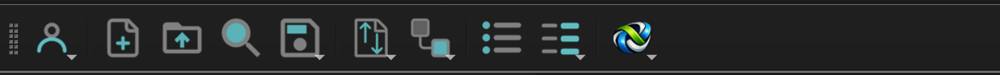
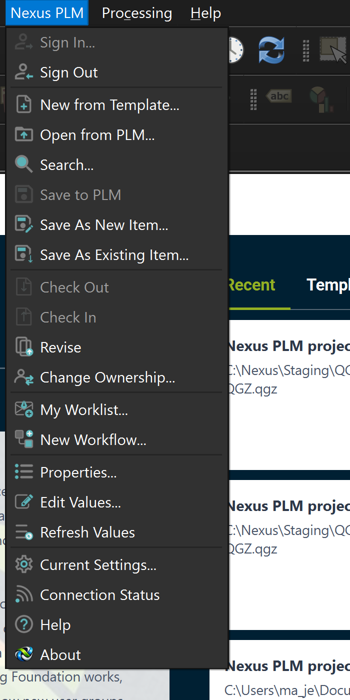
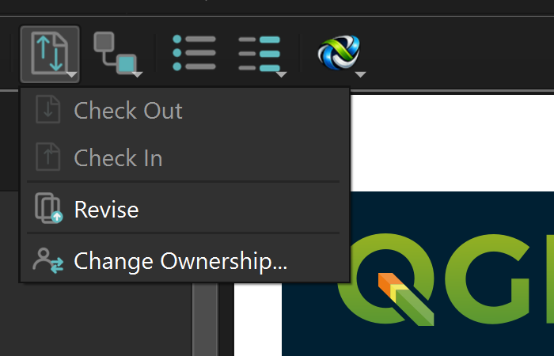

# Nexus PLM for QGIS

[](LICENSE)

Product lifecycle management from inside QGIS. Create a project from a PLM template, check it out,
edit its attributes, check it back in — without leaving QGIS.



The add-in is a PyQGIS plugin with a **Nexus PLM** menu of its own on the menu bar and a toolbar
of dropdown buttons — the same toolbar the LibreOffice add-in has, with the same icons. It talks to
the **Nexus PLM Addin Service** on `localhost:5100`, which owns the dialogs and does the talking to
the PLM server — so the same windows, wording and behaviour appear in QGIS, Inkscape, GIMP, Word,
LibreOffice, OpenOffice and ONLYOFFICE.

Tested against QGIS **4.2.2** (Qt 6.11, PyQt 6.11, bundled Python 3.12).

- **[User guide](docs/user-guide.md)** — every command, what it does, and where the values go.
- **[Developer guide](docs/developer-guide.md)** — how it is built, how to change it, what QGIS
  does differently and how that shaped the design.

---

## What it does

Twenty-one commands, on the menu and on a toolbar of grouped dropdowns:

| Toolbar | Commands |
|---|---|
| **Account ▾** | Sign In · Sign Out |
| New · Open · Search | New from Template · Open from PLM · Search |
| **Save ▾** | Save to PLM · Save As New Item · Save As Existing Item |
| **Tasks ▾** | Check Out · Check In · Revise · Change Ownership |
| **Workflow ▾** | My Worklist · New Workflow |
| Properties · **Values ▾** | Properties · Edit Values · Refresh Values |
| **Nexus PLM ▾** | Current Settings · Connection Status · Help · About |

There is deliberately no Release: a revision reaches Released only by running a workflow, which
New Workflow starts.

**Commands are greyed out when they do not apply.** Check Out is off while the project is checked
out; Check In and Save to PLM are on only when it is checked out to you; Sign In is off while you
are signed in; nothing acts on a project that has never been saved. The rule is the LibreOffice
sidebar's, widened to every command.

<p align="center">
  
  
</p>

## Where the values live

**The record is the point.** Every mapped attribute is written into the project's own **custom
properties**, under the scope `NexusPLM`, inside the `.qgz`. QGIS preserves them through every
save, so the project carries its part number, revision and the rest wherever it goes.

| | Where | |
|---|---|---|
| **The record** | project custom properties, scope `NexusPLM` | Every mapped value. Why this add-in exists. |
| Shown | project variables `nexus_partnumber`, `nexus_revision`, … | A print-layout label reading `[% @nexus_partnumber %]` renders it. The template's **Title Block** layout does. |

The window title is the part number, so two open items can be told apart.

## How it fits together

```
QGIS  ──►  nexus_plm/plugin.py  ──►  nexusplm/commands.py  ──HTTP──►  Addin Service  ──►  Nexus PLM Engine
          (menu, toolbar, enabled state)      │                       (localhost:5100)      Vault, types, workflow
                                        nexusplm/project.py                  │
                                     (the record in the project)   the dialogs a user sees live here,
                                                                   shared by every host
```

The plugin keeps no business rules of its own. It declares what it is (`HOST_NAME`) and what it
can open (`FILE_EXTENSIONS`) with every request — the service needs no code change to gain a host
— writes PLM's values into the project, and asks the service for everything else.

## Installing

Run `NexusPlmQgisAddinSetup.exe` from a [release](../../releases). Per user, no administrator
rights: it copies the plugin into the QGIS 4 default profile and **enables** it. Restart QGIS and
the **Nexus PLM** menu and toolbar appear.

You also need the **Nexus PLM tray application** (`Nexus.PLM.WPF.Addins`) running — it hosts the
service the plugin talks to, and it shows the dialogs.

## Building

```bash
python plugin/build.py --install     # copy into the QGIS 4 default profile and enable; restart QGIS
python -m pytest tests/ -q           # 105 tests; no QGIS needed
"%ProgramFiles(x86)%\Inno Setup 6\ISCC.exe" installer\Nexus.PLM.QGIS.Addin.iss   # the installer
"C:\Program Files\QGIS 4.2.2\bin\python-qgis.bat" tools\build_template.py         # remake the template
```

## Repository layout

| | |
|---|---|
| `plugin/nexus_plm/__init__.py` | `classFactory` — QGIS's entry point. |
| `plugin/nexus_plm/plugin.py` | The menu, the toolbar, one `QAction` per command, and the enabled-state refresh. The only module importing `qgis` at the top. |
| `plugin/nexus_plm/icons/` | The standard Nexus icon set, 16/26/50 px, per command and per dropdown group. |
| `plugin/nexus_plm/nexusplm/menu.py` | The menu table and the toolbar layout — no `qgis`, so tests can read them. |
| `plugin/nexus_plm/nexusplm/availability.py` | Which commands apply, from the service's state and nothing else. |
| `plugin/nexus_plm/nexusplm/commands.py` | One function per command — the whole surface a user touches. |
| `plugin/nexus_plm/nexusplm/project.py` | The record and the display variables, in the live project and in a staged file. |
| `plugin/nexus_plm/nexusplm/host.py` | The parts that know they are inside QGIS. |
| `plugin/nexus_plm/nexusplm/{client,state,identity,navigator}.py` | Shared with the Inkscape and GIMP add-ins; no QGIS API in any of them. |
| `tools/build_template.py` | Makes `dist/QGIS Project.qgz` under QGIS's own Python. |
| `tests/` | pytest with `fakeqgis.py`; runs without QGIS. |
| `installer/` | Inno Setup script; `tests/test_installer.py` holds it against the source. |

## Design notes

All measured on 4.2.2, not assumed.

**QGIS 4 keeps its profile at `%APPDATA%\QGIS\QGIS4\profiles\default`**, not the `QGIS3` path the
QGIS 3 documentation gives. A plugin copied there is **disabled** until `[PythonPlugins]
nexus_plm=true` is in `QGIS\QGIS4.ini`; `build.py` and the installer both write it.

**The title bar shows the project *metadata* title**, not the `<title>` element. The record write
sets both to the part number.

**One project per window.** Opening an item from PLM starts a **new QGIS** rather than loading into
this window, which would replace whatever the user had open. Revise, whose staged file *is* the open
project, writes the new revision's record into the live project instead.

**Uploads write the project to its own file.** `project.write(path)` is what QGIS's own Save does;
the path is uploaded and the project is clean afterwards.

**A staged file is filled without QGIS.** `write_into_file` rewrites the `.qgs` inside the `.qgz`
with `zipfile` and `xml.etree`, copying every other member through, so New from Template opens a
project that already carries its values.

**Plugin code is read at QGIS start.** Reinstalling under a running QGIS changes nothing in it.

**While a Nexus dialog is open the QGIS window reads "Not Responding"** — the plugin call holds the
UI thread. Cosmetic; noted as a follow-up.

## Contributing

Issues and pull requests are welcome. Keep a change and its test together, run the tests before
opening a pull request, and say *why* in the commit body. Work goes on a branch and is merged
through `next`.

## License

MIT — see [LICENSE](LICENSE).
